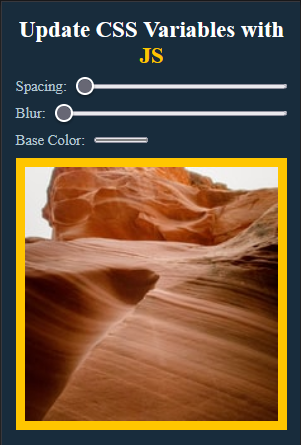

# Wes Bos courses: Playing with CSS variables and JS

## Table of contents

- [Overview](#overview)
  - [Screenshot](#screenshot)
  - [Links](#links)
- [Built with](#built-with)
- [Author](#author)

## Overview
This is a solution to the [Project of the Web Bos course](https://courses.wesbos.com/account/access/62f5161388db94aff3b2dab9/view/194130480).

### Screenshot

### Links
- Solution URL: [GitHub](https://github.com/ButchBet/Playing-with-CSS-variables-and-JS)
- Live Site URL: [Google](https://butchbet.github.io/Playing-with-CSS-variables-and-JS)

### Built with
- Semantic HTML5 markup
- CSS custom properties
- Flexbox
- Mobile-first workflow
- JS vanilla

## Author
- Website - [Butchbet](none)
- Twitter - [@JustButchBet](https://twitter.com/JustButchBet)